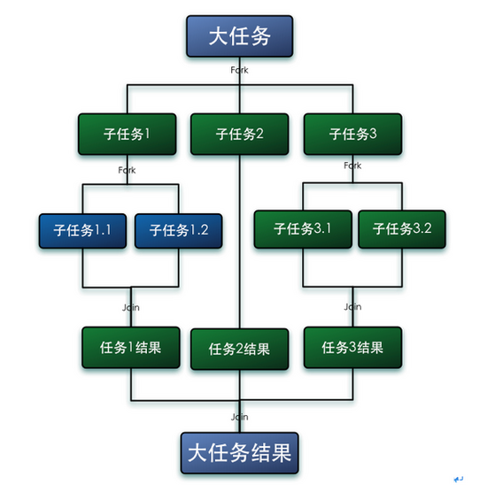

# ForkJoinPool

Fork/Join框架是JAVA7提供的一个用于并行执行任务的框架，是一个把大任务分割成若干个小任务，最终汇总每个小任务结果后得到大任务结果的框架。



## `work-stealing`

指的是某个线程从其他队列里窃取任务来执行。使用的场景是一个大任务拆分成多个小任务，为了减少线程间的竞争，把这些子任务分别放到不同的队列中，并且每个队列都有单独的线程来执行队列里的任务，线程和队列一一对应

### 优势

* 利用了线程进行并行计算，减少了线程间的竞争。

### 劣势

* 如果双端队列中只有一个任务时，线程间会存在竞争
* 窃取算法消耗了更多的系统资源，如会创建多个线程和多个双端队列

## 框架

`ForkJoinTask`一般情况下使用其子类

1. `RecursiveAction`：没有返回结果
2. `RecursiveTask`：有返回结果

```java
package test;

import java.util.concurrent.ExecutionException;
import java.util.concurrent.ForkJoinPool;
import java.util.concurrent.Future;
import java.util.concurrent.RecursiveTask;


public class CountTask extends RecursiveTask<Integer> {
    private static final long serialVersionUID = 1L;
    //阈值
    private static final int THRESHOLD = 2;
    private int start;
    private int end;
    
    public CountTask(int start, int end) {
        this.start = start;
        this.end = end;
    }

    @Override
    protected Integer compute() {
        int sum = 0;
        //判断任务是否足够小
        boolean canCompute = (end - start) <= THRESHOLD;
        if (canCompute) {
            //如果小于阈值，就进行运算
            for(int i = start; i <= end; i++) {
                sum += i;
            }
        } else {
            //如果大于阈值，就再进行任务拆分
            int middle = (start + end)/2;
            CountTask leftTask = new CountTask(start,middle);
            CountTask rightTask = new CountTask(middle+1,end);
            //执行子任务
            leftTask.fork();
            rightTask.fork();
            //等待子任务执行完，并得到执行结果
            int leftResult = leftTask.join();
            int rightResult = rightTask.join();
            //合并子任务
            sum = leftResult + rightResult;
            
        }
        return sum;
    }
    
    public static void main(String[] args) {
        ForkJoinPool forkJoinPool = new ForkJoinPool();
        CountTask task = new CountTask(1,6);
        //执行一个任务
        Future<Integer> result = forkJoinPool.submit(task);
        try {
            System.out.println(result.get());
        } catch (InterruptedException e) {
            e.printStackTrace();
        } catch (ExecutionException e) {
            e.printStackTrace();
        }
        
    }
    
}
```