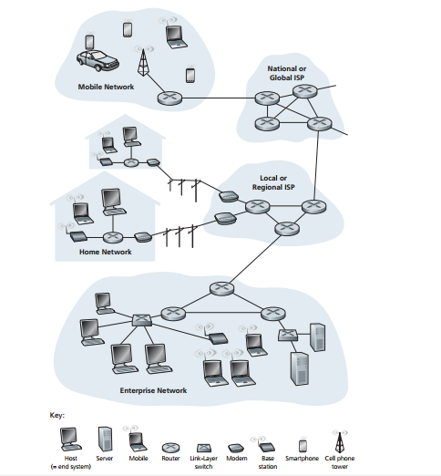
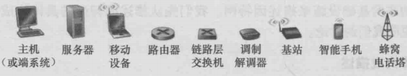
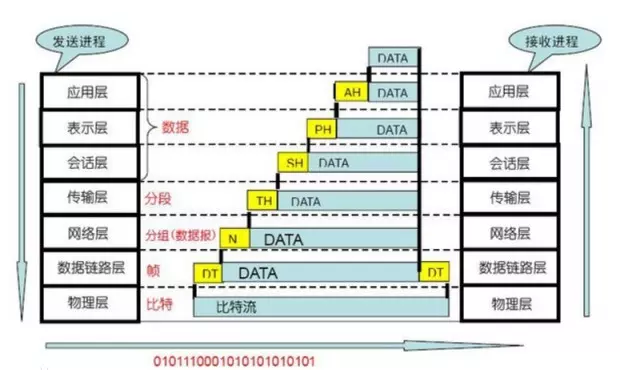

# 计算机网络

## 计算机网络和因特网

计算机网络模型：

计算机模型图例:

osi模型：

所有设备称为 **端系统(end system)** 或者 **主机(host)**

端系统通过 **通信链路(commiuncation link)** 和 **分组交换机(packet switch)** 连接到一起。

不同的链路传输速率不同。传输速率单位`bit/s（比特/秒）/bps`、`kb/s`、`mb/s`

端系统通过因特网服务提供商（ISP）接入因特网。

端系统、分组交换机和其他因特网部件都要运行一系列`协议（protocol）`，这些协议控制因特网中信息的接收和发送。

`协议`： 定义了在两个或多个通信实体间交换报文的格式和次序，以及报文发送或接收一条报文或其他事件采取的动作。

