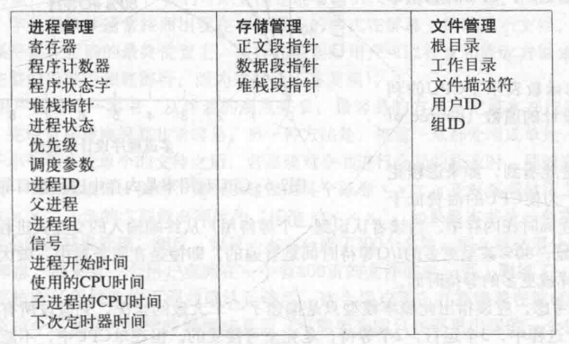
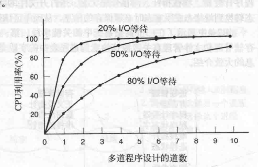

# 操作系统

## 进程与线程

### 进程的基本概念

**定义:** 计算机上所有可运行的软件，通常也包括操作系统，被组织成若干顺序进程( `sequential process` )，简称 **进程**。

`CPU` 会在各个进程之间来回切换，这种快速切换被称为 **多道程序设计**

**进程与程序的区别：** 通俗的比喻程序员给女儿烘制生日蛋糕，有蛋糕的食谱，厨房里有所需的原料。在上述的东西中做蛋糕的食谱就是程序，程序员就是CPU，原料就是输入数据，进程就是程序员阅读菜谱，获取原料和烘制蛋糕的一系列动作的总和。

**`进程`是某种类型的活动，它是`程序`、`输入`、`输出`及`状态`**

**单个CPU可以被若干进程共享，它使用某种调度算法决定何时停止一个进程的工作，并转而为另一个进程提供服务。**

### 进程的创建

#### 四种主要事件导致进程的创建

1. 系统初始化
2. 正在运行的程序执行了创建进程的系统调用。
3. 用户请求创建一个新进程
4. 一个批处理作业的初始化（仅在大型机的的批处理系统中应用）

**`守护进程`:** 停留在后台处理诸如电子邮件、Web页面、新闻、打印之类的活动的进程称为 `守护进程`

#### 进程的退出

1. 正常退出（自愿）
2. 出错退出（自愿）
3. 严重错误（非自愿）
4. 被其他进程杀死（非自愿）

#### 进程的层次结构

* `UNIX`

进程和它的所有子进程及后裔共同组成进程组

* `Windows`

Windows没有进程层次概念，所有进程的地位是相同的，唯一类似于进程的是父进程会在创建时得到一个令牌（称为句柄）

#### 进程的状态

1. 运行态
2. 就绪态
3. 阻塞态

#### 进程的实现

`进程表`: 为了实现进程模型，操作系统维护一张进程表即进程表。每个进程占用一个进程表项。

#### 多道程序设计模型

优势：提高CPU的利用率

若用于计算的平均时间是进程在内存停留时间的20%，且内存中同时又5个进程，则CPU一直满载运行。这个模型在现实中过于乐观，因为它假设5个进程不会同时等待I/O。

假设一个进程等待I/O操作的时间与其停留在内存中的时间的比为p，在内存中存在n个进程，n个进程都等待I/O概率为 $p^n$，则CPU的利用率

$$CPU利用率 = 1 - p^n$$

`n`: 多道程序设计的道数

### 2.2 线程

每个进程有一个地址空间和一个控制线程。

**为何需要线程?**

1. 在应用中存在多个活动，某些活动随着时间推移会被阻塞。将应用程序分解成
可以准并行运行的多个顺序线程。
2. 线程更加轻量级，比进程更加容易创建和撤销。
3. 若多个线程都是CPU密集型的并不能获得什么增强，但存在大量的计算和大量的I/O操作，多个线程允许这些活动彼此重叠进行，会加快程序执行的速度。

