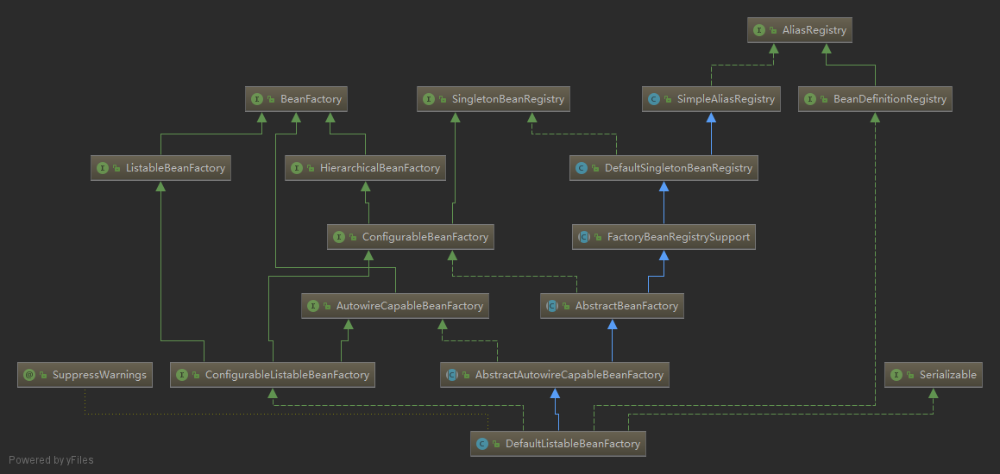

# Spring IOC

## `DefaultListableBeanFactory`

* `AliasRegistry`：一定对`alias`的简单增删改操作
* `SimpleAliasRegistry`：用`Map`作为`alias`的缓存，并实现`AliasRegistry`接口
* `SingletonBeanRegistry`：定义对单例的注册和获取
* `BeanFactory`：定义获取`bean`及`bean`的各种的属性。
* `DefaultSingletonBeanRegistry`：实现`SingletonBeanRegistry`
* `HierarchicalBeanFactory`：继承`BeanFactory`，增加对`parentFactory`的支持。
* `BeanDefinitionRegistry`：定义对`BeanDefinition`的各种增删改操作
* `FactoryBeanRegistruSupport`：在`DefaultSingletonBeanRegistry`基础上增加对`FactoryBean`的特殊处理。
* `ConfigurableBeanFactory`：提供配置`Factory`的各种方法。
* `ListableBeanFactory`：根据各种条件获取`bean`的配置清单。
* `AbstractBeanFactory`：综合`FactoryBeanRegistrySupport`和`ConfigurableBeanFactory`的功能。
* `AutowireCapableBeanFactory`：提供创建`bean`、自动注入、初始化以及应用`bean`的后处理器。
* `AbstractAutowireCapableBeanFactory`：综合`AbstractBeanFactory`并对接口`AutowireCapableBeanFactory`进行实现
* `ConfigurableListableBeanFactory`：`BeanFactory`置清单，指定忽略类型和结果。
`DefaultListableBeanFactory`：综合上述功能，主要是`Bean`注册后的处理