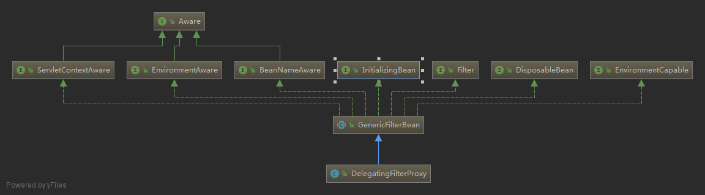

# DelegatingFilterProxy

## 类的继承关系



## 原理

`DelegatingFilterProxy`就是一个对于`servlet filter`的代理，用这个类的好处主要是通过Spring容器来管理`servlet filter`的生命周期，还有就是如果`filter`中需要一些Spring容器的实例，可以通过spring直接注入，另外读取一些配置文件这些便利的操作都可以通过Spring来配置实现。

## 使用方法

```xml
<filter>
    <filter-name>myFilter</filter-name>
    <filter-class>org.springframework.web.filter.DelegatingFilterProxy</filter-class>
</filter>
<filter-mapping>
    <filter-name>myFilter</filter-name>
    <url-pattern>/*</url-pattern>
</filter-mapping>
```

配置具体的`Filter`类实例

```xml
<bean name="myFilter" class="com.*.MyFilter"></bean>
```

**在Spring中配置的bean的name要和`web.xml`中的`<filter-name>`一样或者在DelegatingFilterProxy的filter配置中配置初始参数：`targetBeanName`，对应到Spring配置中的beanname**

**如果要保留Filter原有的init，destroy方法的调用，还需要配置初始化参数`targetFilterLifecycle`为`true`，该参数默认为`false`**

```xml
<filter>
        <filter-name>DelegatingFilterProxy</filter-name>
        <filter-class>org.springframework.web.filter.DelegatingFilterProxy</filter-class>
    	<init-param>
      		<param-name>ignoreUrls</param-name>
      		<param-value>/caClient.jsp,/403.jsp,/login.html*,/j_spring_security_check,/accounts/**,/secure/logout,/js/**,/app/**,/images/**,/icons/**,/lib/**,/resource/**,/secure/changepassword</param-value>
    	</init-param>        
        <init-param>
            <param-name>targetBeanName</param-name>
            <param-value>commonWebFilter</param-value>
        </init-param>
        <init-param>
            <param-name>targetFilterLifecycle</param-name>
            <param-value>true</param-value>
        </init-param>
    </filter>
 
    <filter-mapping>
        <filter-name>DelegatingFilterProxy</filter-name>
        <url-pattern>/*</url-pattern>
    </filter-mapping>
```

applicationContext.xml

```xml
<bean id="commonWebFilter" class="com.wonders.LoginFilter"/>
```