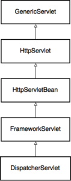

# How Spring Web MVC Really Works Note

文章地址：[How Spring Web MVC Really Works](https://stackify.com/spring-mvc/)

* `Model`：a key-value map of data used to render the page，用来存储数据的键值对
* `View`：a template of the page that is filled with data from the model，页面模版，通过model填充数据

## `Spring Mvc`核心`DispatcherServlet`

作用：

* 将一个`HTTP`请求映射到某个方法处理
* 将请求数据和请求头转为域对象或者DTO
* Model、View、Controller相互作用
* 生成响应
* 将请求映射到一个类或者方法处理（实现`HandlerMapping`接口）
* 用一个特定的模式处理一个请求
* 通过名称生成view
* 上传文件的处理
* 本地化的处理

## 请求的处理过程

### `GenericServlet`

此类的关注点不是在Http请求上，而是定义`service()`方法接收请求和响应请求。

### `HttpServlet`

关注于Http请求，主要是覆写`service`方法通过`Http Method`分发请求。

### `HttpServletBean`

是一个Spring的类，将`web.xml`或者`WebApplicationInitializer`获取到的
`init-param`的值注入到Spring管理的`Bean`中。

### `FrameworkServlet`

`FrameworkServlet`通过实现`ApplicationContextAware`接口和`webApplicationContext`交互。默认使用`XmlWebApplicationContext`。XML配置的方式过时了，Spring Boot默认使用`AnnotationConfigWebApplicationContext`配置`DispatcherServlet`。

### `DispatcherServlet`

作用：同一处理请求

